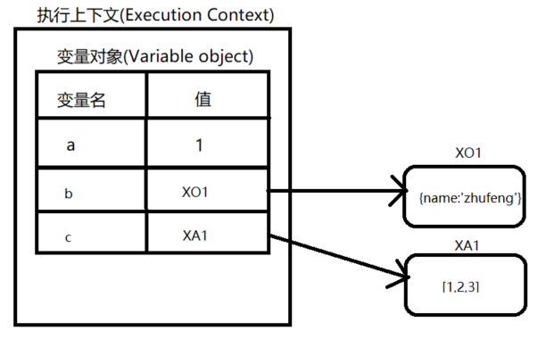
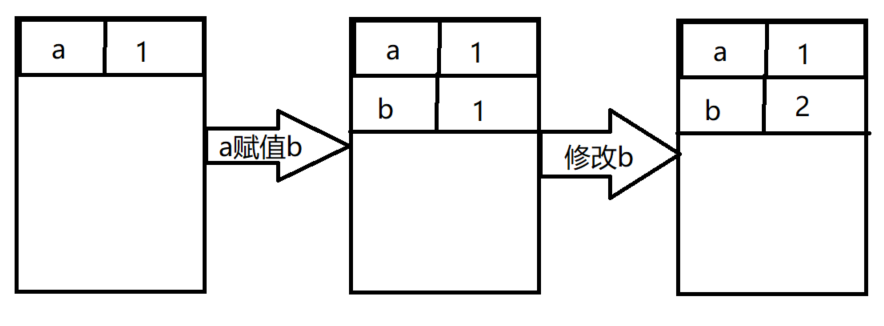
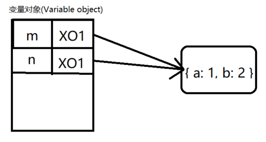

# 执行上下文

## 1.如何存储

* 当函数运行时，会创建一个执行环境，这个执行环境就叫执行上下文(Execution Context)
* 执行上下文中会创建一个对象叫作变量对象(Value Object),基础数据类型都保存在变量对象中
* 引用数据类型的值保存在堆里，我们通过操作对象的引用地址来操作对象

```
function task(){
    var a = 1;
    var b = {
        name:'zhufeng'
    }
    var c = [1,2,3];
}
```

```
let ExecuteContext = {
    VO:{
        a:1,
        b:'XO1',
        c:'XA1'
    }
};
```



## 2.如何赋值
### 2.1 基本数据
基本数据类型复制的是值本身

```
var a = 1;
var b = a;
b = 2;
console.log(a);
```

```
var ExecuteContext = {
    VO: { a: 1 }
};

ExecuteContext.VO.b = ExecuteContext.VO.a;
ExecuteContext.VO.b = 2;
console.log(ExecuteContext.VO.a);
```




### 2.2 引用类型数据

引用数据类型复制的是引用地址指针

```
var m = { a: 1, b: 2 };
var n = m;
n.a = 10;
console.log(m.a);
```

```
var ExecuteContext = {
    VO: { m: { a: 1, b: 2 } }
};

ExecuteContext.VO.b = ExecuteContext.VO.a;
ExecuteContext.VO.a = 10;
console.log(ExecuteContext.VO.a);
```



## 3.多个执行上下文栈

### 3.1执行上下文分类
* JS代码在执行的时候会进入一个执行上下文，可以理解为当前代码的运行环境
* 在JS中运行环境主要分为全局执行上下文环境和函数环执行上下文环境
    * 全局执行上下文只有一个，在客户端中一般由浏览器创建，也就是我们熟知的window对象，我们能通过this直接访问到它
    * window对象还是var声明的全局变量的载体。我们通过var创建的全局对象，都可以通过window直接访问
### 3.2多个执行上下文
* 在JS执行过程会产出多个执行上下文,JS引擎会有栈来管理这些执行上下文
* 执行上下文栈(下文简称执行栈)也叫调用栈，执行栈用于存储代码执行期间创建的所有上下文，具有LIFO（Last In First Out后进先出，也就是后进后出）的特性
* 栈底永远是全局上下文，栈顶为当前正在执行的上下文
* 当开启一个函数执行时会生成一个新的执行上下文并放入调用栈，执行完毕后会自动出栈

```
function one() {
    var a = 1;
    debugger;
    function two() {
        var b = 1;
        debugger;
        function three() {
            var c = 1;
            debugger;
        }
        three();
        debugger;
    }
    two();
    debugger;
}
one();
```

```
var globalExecuteContext = {
    VO: { setTimeout: 'setTimeout' }
}
var executeContextStack = [globalExecuteContext];
var oneExecuteContext = {
    VO: { a: 1 }
}
executeContextStack.push(oneExecuteContext);
var twoExecuteContext = {
    VO: { b: 2 }
}
executeContextStack.push(twoExecuteContext);
var threeExecuteContext = {
    VO: { c: 3 }
}
executeContextStack.push(threeExecuteContext);
console.log(executeContextStack);

executeContextStack.pop();
executeContextStack.pop();
executeContextStack.pop();
```

## 4.执行上下文生命周期
### 4.1 一个新的执行上下文的生命周期有两个阶段
* 创建阶段
    * 创建变量对象
    * 确定作用域链
    * 确定this指向
* 执行阶段
    * 变量赋值
    * 函数赋值
    * 代码执行

### 4.2 变量对象
* 变量对象会保存变量声明(var)、函数参数(arguments)、函数定义(function)
    * 变量对象会首先获得函数的参数变量和值
    * 获取所有用function进行的函数声明，函数名为变量对象的属性名，值为函数对象,如果属性已经存在，值会用新值覆盖
    * 再依次所有的var关键字进行的变量声明，每找到一个变量声明，就会在变量对象上建一个属性，值为undefined,如果变量名已经存在，则会跳过，并不会修改原属性值,let声明的变量并不会在此阶段进行处理
函数声明优先级更高，同名的函数会覆盖函数和变量，但同名var变量并不会覆盖函数.执行阶段重新赋值可以改变原有的值

#### 4.2.1基本类型
```
console.log(a);
var a = 1;

var a = undefined;//变量提升
console.log(a);
a = 1;
```

#### 4.2.2变量提升
```
var a = 1;
function fn(m) { console.log('fn'); }
function fn(m) { console.log('new_fn'); }
function a() { console.log('fn_a'); }
console.log(a);
fn(1);
var fn = 'var_fn';
console.log(fn);
//1
//new_fn
//var_fn
```
真正执行：
```
// 创建阶段
function fn(m) { console.log('fn'); }
function fn(m) { console.log('new_fn'); }
function a() { console.log('fn_a'); }
var a = undefined;
var fn = undefined;
//执行阶段
a = 1;
console.log(a);
fn();
fn = 'var_fn';
console.log(fn);
```

上下文
```
// 创建阶段
var globalEC = {
    VO: {
        ...arguments,
        a: () => { console.log('fn_a'); },
        fn: () => { console.log('new_fn'); }
    }
}
var ECStack = [globalEC];
//执行阶段
globalEC.VO.a = 1;
console.log(globalEC.VO.a);
globalEC.VO.fn();
globalEC.VO.fn = 'var_fn';
console.log(globalEC.VO.fn);
```

#### 4.2.3激活对象
* 在函数的调用栈中，如果当前执行上下文处于函数调用栈的顶端，则意味着当前上下文处于激活状态，此时变量对象称为活动对象(AO,Activation Object) VO=>AO
* 活动变量包含变量对象所有的属性，并有包含this指针

```
function one(m) {
    function two() {
        console.log('two');
    }
}
one(1);

//执行阶段 VO=>AO
let VO = AO = {
    m:1,
    two: () => { console.log('two'); },

}
let oneEC={
    VO,
    this: window,
    scopeChain:[VO,globalVO]
}
```

#### 4.2.4全局上下文的变量对象
* 在浏览器里，全局对象为window
* 全局上下文的变量对象为window,而且这个变量对象不能激活变成活动对象
* 只在窗口打开，全局上下文会一直存在，所有的上下文都可以直接访问全局上下文变量对象上的属性
* 只有全局上下文的变量对象允许通过VO的属性名称来间接访问，在函数上下文中是不能直接访问VO对象的
* 未进入执行阶段前，变量对象中的属性都不能访问！但是进入到执行阶段之后，变量对象转变成了活动对象，里面的属性都能被访问了,对于函数上下文来讲，活动对象与变量对象其实都是同一个对象,只是处于执行上下文的不同生命周期
