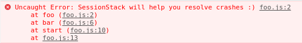

# 内存空间详细图解

某些情况下，调用堆栈中函数调用的数量超出了调用堆栈的实际大小，浏览器会抛出一个错误终止运行。

对于下面的递归就会无限制的执行下去，直到超出调用堆栈的实际大小，这个是浏览器定义的。

```
function foo() {
    foo();
}
foo();
```



## 栈数据结构
栈的结构就是后进先出**（LIFO）**，如果读过前面两篇文章应该是相当熟悉了。文中使用乒乓球盒子的结构来解释。

处于盒子中最顶层的乒乓球5，它一定是最后被放进去，但可以最先被使用。而我们想要使用底层的乒乓球1，就必须将上面的4个乒乓球取出来，让乒乓球1处于盒子顶层1


## 堆数据结构
堆数据结构是一种树状结构。它的存取数据的方式与书架和书非常相似。我们只需要知道书的名字就可以直接取出书了，并不需要把上面的书取出来。JSON格式的数据中，我们存储的key-value可以是无序的，因为顺序的不同并不影响我们的使用，我们只需要关心书的名字。

## 队列
队列是一种先进先出（FIFO）的数据结构，这是事件循环（Event Loop）的基础结构


## 变量的存放
首先我们应该知道内存中有栈和堆，那么变量应该存放在哪里呢，堆？栈？

* 1、基本类型 --> 保存在栈内存中，因为这些类型在内存中分别占有固定大小的空间，通过按值来访问。基本类型一共有6种：Undefined、Null、Boolean、Number 、String和Symbol
* 2、引用类型 --> 保存在堆内存中，因为这种值的大小不固定，因此不能把它们保存到栈内存中，但内存地址大小的固定的，因此保存在堆内存中，在栈内存中存放的只是该对象的访问地址。当查询引用类型的变量时， 先从栈中读取内存地址， 然后再通过地址找到堆中的值。对于这种，我们把它叫做按引用访问


在计算机的数据结构中，栈比堆的运算速度快，Object是一个复杂的结构且可以扩展：数组可扩充，对象可添加属性，都可以增删改查。将他们放在堆中是为了不影响栈的效率。而是通过引用的方式查找到堆中的实际对象再进行操作。所以查找引用类型值的时候先去栈查找再去堆查找。

## 几个问题
问题1：
```
var a = 20;
var b = a;
b = 30;

// 这时a的值是多少？
```
问题2：

```
var a = { name: '前端开发' }
var b = a;
b.name = '进阶';

// 这时a.name的值是多少
```

问题3：

```
var a = { name: '前端开发' }
var b = a;
a = null;

// 这时b的值是多少
```

现在来解答一下，三个问题的答案分别是20、‘进阶’、{ name: '前端开发' }

* 对于问题1，a、b都是基本类型，它们的值是存储在栈中的，a、b分别有各自独立的栈空间，所以修改了b的值以后，a的值并不会发生变化。
* 对于问题2，a、b都是引用类型，栈内存中存放地址指向堆内存中的对象，引用类型的复制会为新的变量自动分配一个新的值保存在变量对象中，但只是引用类型的一个地址指针而已，实际指向的是同一个对象，所以修改b.name的值后，相应的a.name也就发生了改变。
* 对于问题3，首先要说明的是null是基本类型，a = null之后只是把a存储在栈内存中地址改变成了基本类型null，并不会影响堆内存中的对象，所以b的值不受影响。

## 内存空间管理
JavaScript的内存生命周期是

* 1、分配你所需要的内存
* 2、使用分配到的内存（读、写）
* 3、不需要时将其释放、归还
JavaScript有自动垃圾收集机制，最常用的是通过标记清除的算法来找到哪些对象是不再继续使用的，使用a = null其实仅仅只是做了一个释放引用的操作，让 a 原本对应的值失去引用，脱离执行环境，这个值会在下一次垃圾收集器执行操作时被找到并释放。

在局部作用域中，当函数执行完毕，局部变量也就没有存在的必要了，因此垃圾收集器很容易做出判断并回收。但是全局变量什么时候需要自动释放内存空间则很难判断，因此在开发中，需要尽量避免使用全局变量。


## 思考题
```
var a = {n: 1};
var b = a;
a.x = a = {n: 2};

a.x 	// 这时 a.x 的值是多少
b.x 	// 这时 b.x 的值是多少
```