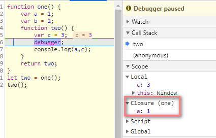
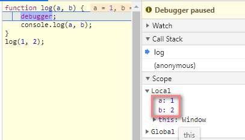

# 闭包

* 闭包有两部分组成，一个是当前的执行上下文A，一个是在该执行上下文中创建的函数B
* 当B执行的时候引用了当前执行上下文A中的变量就会产出闭包
* 当一个值失去引用的时候就会会标记，被垃圾收集回收机回收并释放空间
* 闭包的本质就是在函数外部保持内部变量的引用，从而阻止垃圾回收
* 调用栈的并不会影响作用域链,函数调用栈是在执行时才确定，而作用域规则是在代码编译阶段就已经确定了
* MDN定义:闭包是指这样的作用域foo,它包含了一个函数fn，这个函数fn1可以调用被这个作用域所封闭的变量a、函数等内容

## 闭包
* Call Stack为当前的函数调用栈
* Scope为当前正在被执行函数的作用域链
* Local为当前的活动对象

```
function one() {
    var a = 1;
    var b = 2;
    function two() {
        var c = 3;
        debugger;
        console.log(a,c);
    }
    return two;
}
let two = one();
two();
```

```
function one() {
    var a = 1;
    var b = 2;
    function two() {
        debugger;
        console.log(a);
    }
    two();
}
one();
```



## 闭包优化

中间没用到的变量闭包会被忽略
```
function one() {
    var a = 1;
    function two() {
        var b = 2;
        function three() {
            var c = 3;
            debugger;
            console.log(a, b, c);
        }
        three();
    }
    two();
}
one();
```

```
function one() {
    var a = 1;
    function two() {
        var b = 2;
        function three() {
            var c = 3;
            debugger;
            console.log(a, c);
        }
        three();
    }
    two();
}
one();
```

## arguments
```
function log(a, b) {
    debugger;
    console.log(a, b);
}
log(1, 2);
```

