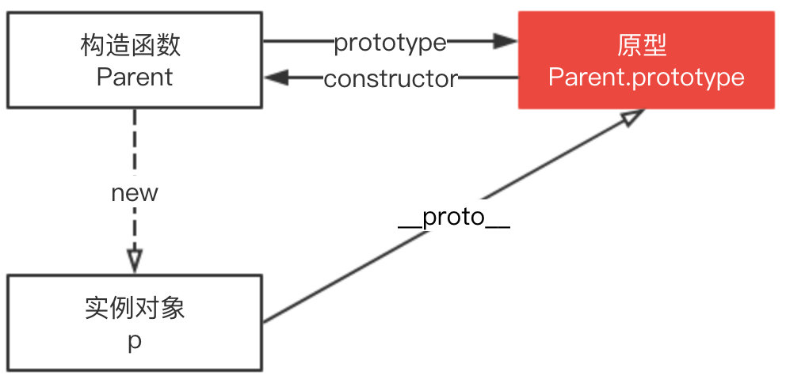

# 构造函数、原型和原型链


## 构造函数
什么是构造函数
constructor 返回创建实例对象时构造函数的引用。此属性的值是对函数本身的引用，而不是一个包含函数名称的字符串。

```
// 木易杨
function Parent(age) {
    this.age = age;
}

var p = new Parent(50);
p.constructor === Parent; // true
p.constructor === Object; // false
```

构造函数本身就是一个函数，与普通函数没有任何区别，不过为了规范一般将其首字母大写。构造函数和普通函数的区别在于，使用 new 生成实例的函数就是构造函数，直接调用的就是普通函数。

## 原型
JavaScript 是一种基于原型的语言 (prototype-based language)，每个对象拥有一个原型对象，对象以其原型为模板，从原型继承方法和属性，这些属性和方法定义在对象的构造器函数的 prototype 属性上，而非对象实例本身。


从上面这张图可以发现，Parent 对象有一个原型对象 Parent.prototype，其上有两个属性，分别是 constructor 和 `__proto__`，其中 `__proto__` 已被弃用。

构造函数 Parent 有一个指向原型的指针，原型 Parent.prototype 有一个指向构造函数的指针 Parent.prototype.constructor，如上图所示，其实就是一个循环引用。


## `__proto__`
上图可以看到 Parent 原型（ Parent.prototype ）上有 `__proto__` 属性，这是一个访问器属性（即 getter 函数和 setter 函数），通过它可以访问到对象的内部 `[[Prototype]]` (一个对象或 null )。

`[[Prototype]]` 是对象的一个内部属性，外部代码无法直接访问。

这里用 `p.__proto__` 获取对象的原型，`__proto__` 是每个实例上都有的属性，prototype 是构造函数的属性，这两个并不一样，但 `p.__proto__` 和 Parent.prototype 指向同一个对象。

```
function Parent() {}
var p = new Parent();
p.__proto__ === Parent.prototype
// true
```

所以构造函数 Parent、Parent.prototype 和 p 的关系如下图。



## 原型链
每个对象拥有一个原型对象，通过 `__proto__` 指针指向上一个原型 ，并从中继承方法和属性，同时原型对象也可能拥有原型，这样一层一层，最终指向 null。这种关系被称为原型链 (prototype chain)，通过原型链一个对象会拥有定义在其他对象中的属性和方法。

我们看下面一个例子

```
// 木易杨
function Parent(age) {
    this.age = age;
}

var p = new Parent(50);
p.constructor === Parent; // true
```

这里 p.constructor 指向 Parent，那是不是意味着 p 实例存在 constructor 属性呢？并不是。

我们打印下 p 值就知道了。


由图可以看到实例对象 p 本身没有 constructor 属性，是通过原型链向上查找 `__proto__ `，最终查找到 constructor 属性，该属性指向 Parent。

```
function Parent(age) {
    this.age = age;
}
var p = new Parent(50);

p;	// Parent {age: 50}
p.__proto__ === Parent.prototype; // true
p.__proto__.__proto__ === Object.prototype; // true
p.__proto__.__proto__.__proto__ === null; // true
```


## instance原理及实现

instanceof 运算符用来检测 constructor.prototype 是否存在于参数 object 的原型链上。

instanceof 原理就是一层一层查找 `__proto__`，如果和 constructor.prototype 相等则返回 true，如果一直没有查找成功则返回 false。

```
instance.[__proto__...] === instance.constructor.prototype
```

知道了原理后我们来实现 instanceof，代码如下。

```
function instance_of(L, R) {//L 表示左表达式，R 表示右表达式
   var O = R.prototype;// 取 R 的显示原型
   L = L.__proto__;// 取 L 的隐式原型
   while (true) { 
       // Object.prototype.__proto__ === null
       if (L === null) 
         return false; 
       if (O === L)// 这里重点：当 O 严格等于 L 时，返回 true 
         return true; 
       L = L.__proto__; 
   } 
}

// 测试
function C(){} 
function D(){} 

var o = new C();

instance_of(o, C); // true
instance_of(o, D); // false
```

