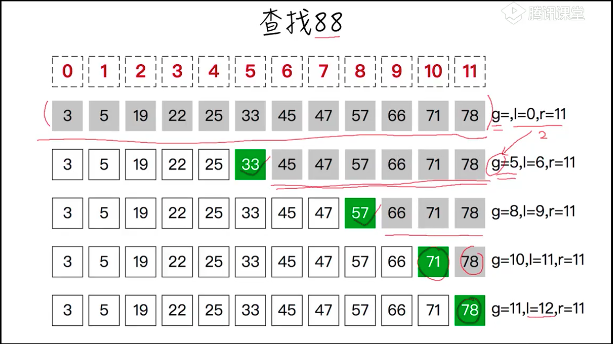
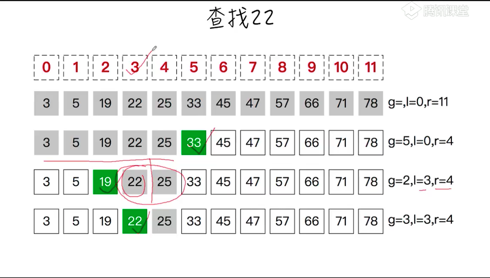
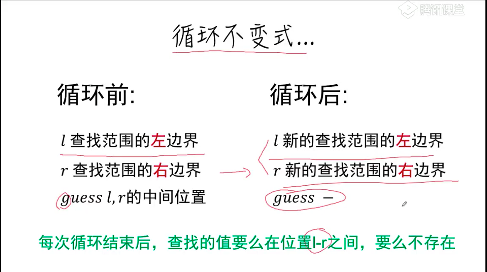

# 二分查找

## 描述
二分查找也称折半查找（Binary Search），它是一种效率较高的查找方法。但是，折半查找要求线性表必须采用顺序存储结构，而且表中元素按关键字有序排列。

## 抽象
```
function binarySearch(A, x)

A: 数组
x: 需要查找的值
返回值：x在A中的位置，不存在返回-1
```

## 猜想




## 循环不变式


## 实现
```
function bsearch(A, x){
    let l = 0, // 查询范围左边界
        r = A.length -1, // 查找范围右边界
        guess // 猜测位置
    while(l <= r){
        guess = Math.floor((l+r)/2)
        if(A[guess] === x) return guess
        else if(A[guess] > x) r = guess -1
        else l = guess + 1

        // 循环不变式
        // l: 新查找范围左
        // r: 新查找范围右
    }
    return -1
}
```

## 验证
```
const A = [3,5,19,22,35,33,45,47,57,66,71,78]
console.log(bsearch(A, 88))
console.log(bsearch(A, 33))
console.log(bsearch(A, 22))
```
