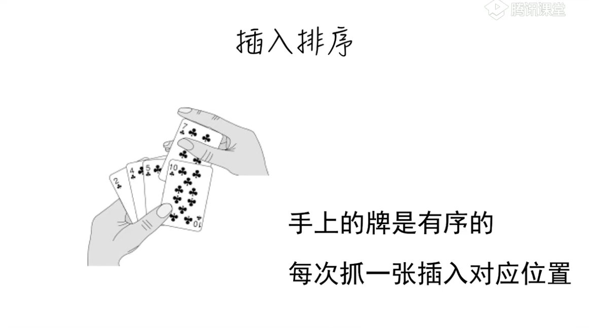
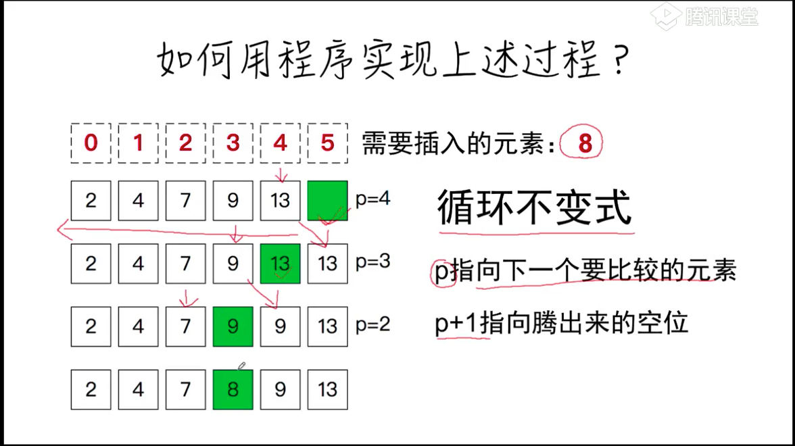
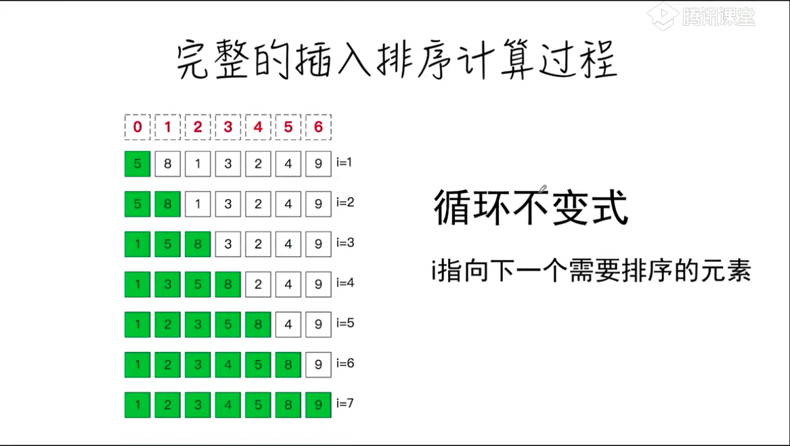

# 插入排序

## 描述


## 动画演示


## 算法描述
一般来说，插入排序都采用in-place在数组上实现。具体算法描述如下：

* 从第一个元素开始，该元素可以认为已经被排序；
* 取出下一个元素，在已经排序的元素序列中从后向前扫描；
* 如果该元素（已排序）大于新元素，将该元素移到下一位置；
* 重复步骤3，直到找到已排序的元素小于或者等于新元素的位置；
* 将新元素插入到该位置后；
* 重复步骤2~5。

## 抽象
```
function insert(A, x)
A: 已排序的数组
x: 需要插入的元素
返回值：无
```

## 猜想


## 实现
```
function insert(A, x){
    // p指向下一个需要比较的元素
    // p+1指向空位
    let p = A.length - 1
    
    while(A[p] > x && p >=0){
        A[p+1] = A[p]
        p--
    }
    A[p + 1] = x
}
```

## 验证
```
const A = [2,4,7,9,13]
const x = 8
insert(A,x)
console.log(A)
```

## 完成的插入排序的计算过程


## 实现过程
```
function insertion_sort(A){
    for(let i=1; i< A.length; i++){
        insert(A, i, A[i])
    }
}

// 排序的过程中A数组是一直变化的
function insert(A, i, x){
    let p = i -1 // p指向下一个需要比较的位置
    while(p >=0 && A[p] > x){
        A[p+1] = A[p]
        p--
    }
    A[p+1] = x
}

const A = [5,8,1,3,2,4,9]
insertion_sort(A)
console.log(A)
```

## 另一种实现
```
function insertion_sort(arr){
    let len = arr.length

    for(let i=1; i<len; i++){
        for(let j= i; j >0; j--){
            if(arr[j] < arr[j-1]){
                swap(arr, j, j-1)
            }else{
                break
            }
        }
    }
}
```

## 效果更高的实现
```
function insertion_sort(arr){
    let len = arr.length
    for(let i=1; i< len; i++){
        let temp = arr[i]
        for(let j=i; j > 0 && temp < arr[j-1]; j--){
                arr[j] = arr[j-1]
        }
        arr[j] = temp
    }
}
```

## 使用while
```
function insertion_sort(arr){
    let len = arr.length
    for(let i=1; i< len; i++){
        let preIndex = i-1
        let current = arr[i]
        while(preIndex >= 0 && arr[preIndex] > current){
            arr[preIndex + 1] = arr[preIndex]
        }
        arr[preIndex + 1] = current
    }
    return arr
}
```


