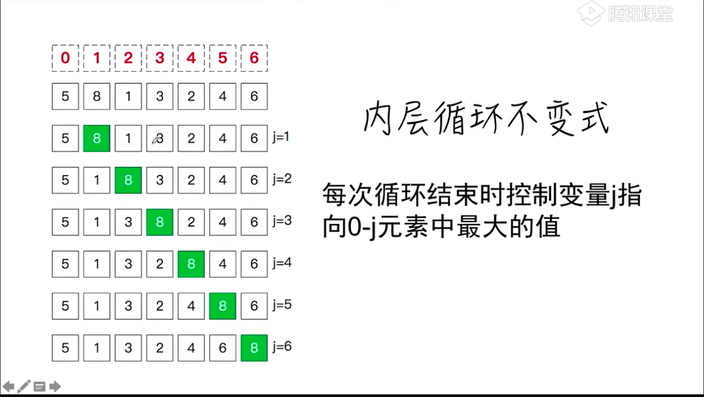

# 冒泡排序

## 描述
> 冒泡排序是一种简单的排序算法，它重复地走访过要排序的数列，一次比较两个元素，
如果它们的顺序错误就把它们交换过来。走访数列的工作是重复的进行，直到没有再需要交换，也就是说该数列已经排序完成。

* 1.比较相邻的元素。如果第一个比第二个大，就交换它们两个；
* 2.对每一对相邻元素作同样的工作，从开始第一对到结尾的最后一对，这样在最后的元素应该会是最大的数；
* 3.针对所有的元素重复以上的步骤，除了最后一个；
* 4.重复步骤1~3，直到排序完成

## 动画演示


## 抽象
```
function bubble_sort(A)
A: 需要排序的数组
返回值： 无
```

## 猜想




## 实现
```
function swap(A, i, j){
    const t = A[i]
    A[i] = A[j]
    A[j] = t
}

// 难点就是边界问题
function bubble_sort(A){
    for(let i = A.length -1; i>=1; i--){
        for(let j=1; j<=i; j++){
            A[j-1] > A[j] && swap(A, j-1, j)
            // 循环结束j执行A[0]-A[j]中的最大值
        }
        // 循环结束A[i]-A[n-1] 已排序
    }
}
```


## 更好理解的算法
```
function bubble_sort(arr) {
  let i, j, temp
  let len = arr.length
  for (i = 0; i < len - 1; i++){ // 循环len - 1次
    
    // 之所以是-i，是因为每一次j的循环都将最大的数冒出到最后，所以后面的i个数是已经完成了排序的
    for (j = 0;j < len - i -1 ;j++ ) {
        if (arr[j] > arr[j + 1]) { // j+1会不会越界
          temp = arr[j]
          arr[j] = arr[j + 1]
          arr[j + 1] = temp
        }
    }
  }
}

bubble_sort([5, 8, 1, 3, 2])
```


