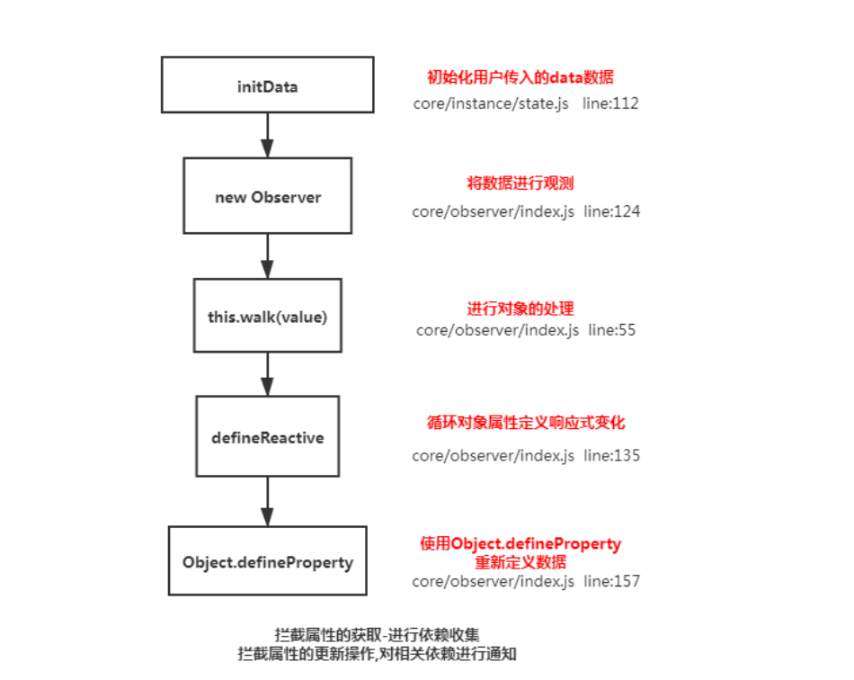
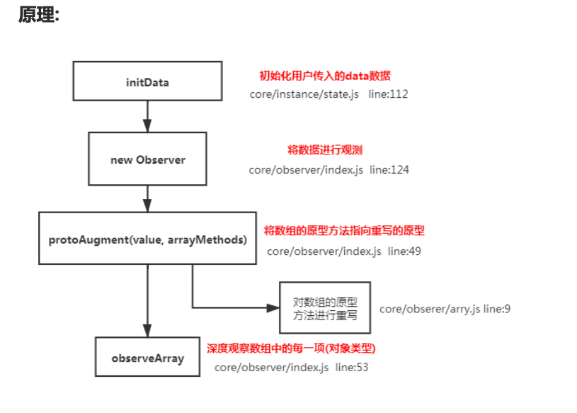
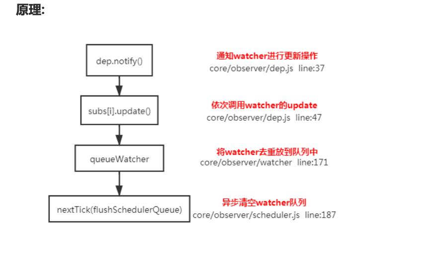
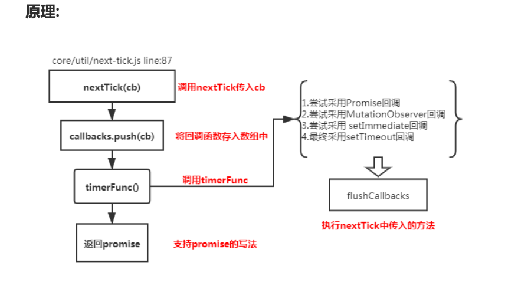
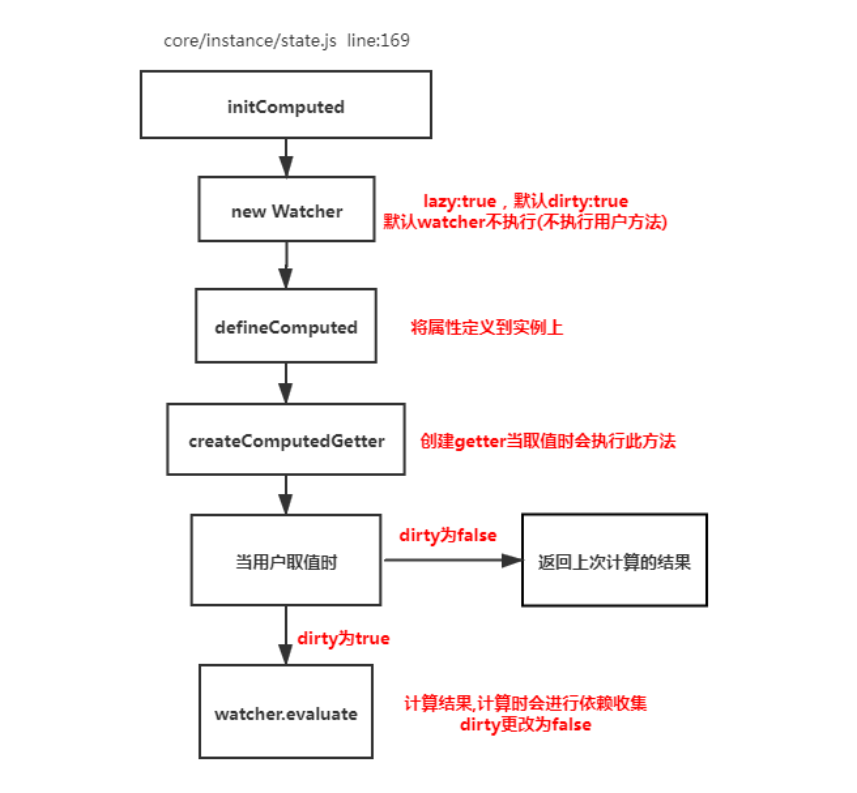

# Vue 面试题

## 1.谈一下你对 MVVM 原理的理解

- 传统的 MVC 指的是，用户操作会请求服务端路由，路由会调用对应的控制器来处理，控制器会获取数据。将结果返回给前端，页面重新渲染
- MVVM：传统的前端会将数据手动渲染到页面上, MVVM 模式不需要用户收到操作 dom 元素,将数据绑 定到 viewModel 层上，会自动将数据渲染到页面中，视图变化会通知 viewModel 层 更新数据。ViewModel 就是我们 MVVM 模式中的桥梁。

## 2.请说一下响应式数据的原理?

- 核心点: Object.defineProperty
- 默认 Vue 在初始化数据时，会给 data 中的属性使用 Object.defineProperty 重新定义所有属 性,当页面取到对应属性时。会进行依赖收集(收集当前组件的 watcher) 如果属性发生变化会通 知相关依赖进行更新操作。



```
Object.defineProperty(obj, key, {
  enumerable: true,
  configurable: true,
  get: function reactiveGetter() {
    const value = getter ? getter.call(obj) : val
    if (Dep.target) {
      dep.depend() // ** 收集依赖 ** /
      if (childOb) {
        childOb.dep.depend()
        if (Array.isArray(value)) {
          dependArray(value)
        }
      }
    }
    return value
  },
  set: function reactiveSetter(newVal) {
    const value = getter ? getter.call(obj) : val
    if (newVal === value || (newVal !== newVal && value !== value)) {
      return
    }
    if (process.env.NODE_ENV !== 'production' && customSetter) {
      customSetter()
    }
    val = newVal
    childOb = !shallow && observe(newVal)
    dep.notify() /**通知相关依赖进行更新**/
  }
})
```

## 3. Vue中是如何检测数组变化?
* 使用函数劫持的方式，重写了数组的方法
* Vue 将 data 中的数组，进行了原型链重写。指向了自己定义的数组原型方法，这样当调用数组 api 时，可以通知依赖更新.如果数组中包含着引用类型。会对数组中的引用类型再次进行监控。



```

// 数据劫持时
if(Array.isArray(data)){ // 我需要重写 push 方法等
    // 只能拦截数组的方法 ，数组里的每一项 还需要去观测一下
    data.__proto__ = arrayMethods; //让数组 通过链来查找我们自己编写的原型
    // 当调用数组的方法时 手动通知
    observerArray(data); // 观测数据中的每一项
}
```

拦截用户调用的push shift unshift pop reverse sort splice

```
// 主要要做的事就是拦截用户调用的push shift unshift pop reverse sort splice

// concat ...

// 先获取老的数组的方法 只改写这7个方法
let oldArrayProtoMethods = Array.prototype;

// 拷贝的一个新的对象 可以查找到 老的方法
// Object.create()方法创建一个新对象，使用现有的对象来提供新创建的对象的__proto__
export let arrayMethods = Object.create(oldArrayProtoMethods);

// 原型链 prototype  __proto__ 
let methods = [
    'push',
    'shift',
    'pop',
    'unshift',
    'reverse',
    'sort',
    'splice'
];
// {arr:[{a:1}]}
export function observerArray(inserted){ // 要循环数组一次对数组中没一项进行观测
    for(let i = 0 ; i < inserted.length;i++){
        observe(inserted[i]); // 没有 对数组的索引进行监控
    }
}
export function dependArray(value){ // 递归收集数组中的依赖
    for(let i = 0; i < value.length;i++){
        let currentItem = value[i]; // 有可能也是一个数组 arr: [[[[[]]]]]
        currentItem.__ob__ && currentItem.__ob__.dep.depend();
        if(Array.isArray(currentItem)){
            dependArray(currentItem); // 不停的手机 数组中的依赖关系
        }
    }
}

// 重写部分方法
methods.forEach(method=>{   // arr.push(1,2,3)  args=[1,2,3]
    arrayMethods[method] = function (...args) { // 函数劫持  切片编程
        // call apply bind的用法
        let r = oldArrayProtoMethods[method].apply(this,args);
        // todo
        let inserted;
        switch (method) { // 只对 新增的属性 再次进行观察 其他方法没有新增属性
            case 'push':
            case 'unshift':
                inserted = args;
                break;
            case 'splice':
                inserted = args.slice(2);  // 获取splice 新增的内容
            default:
                break;
        }
        if(inserted) observerArray(inserted);
        console.log('调用了数组更新的方法了  -- 更新视图')
        this.__ob__.dep.notify() // ** 通知视图更新
        return r;
    }
})
```

## 4.为何Vue采用异步渲染？
因为如果不采用异步更新，那么每次更新数据都会对当前组件进行重新渲染.所以为了性能考虑。 Vue 会在本轮数据更新后，再去异步更新视图!



```
function update() {
  /* istanbul ignore else */ if (this.lazy) {
    this.dirty = true
  } else if (this.sync) {
    this.run()
  } else {
    queueWatcher(this) // 当数据发生变化时会将watcher放到一个队列中批量更新
  }
}
function queueWatcher(watcher) {
  const id = watcher.id // 会对相同的watcher进行过滤
  if (has[id] == null) {
    has[id] = true
    if (!flushing) {
      queue.push(watcher)
    } else {
      let i = queue.length - 1
      while (i > index && queue[i].id > watcher.id) {
        i--
      }
      queue.splice(i + 1, 0, watcher)
    }
    // queue the flush
    if (!waiting) {
      waiting = true
      if (process.env.NODE_ENV !== 'production' && !config.async) {
        flushSchedulerQueue()
        return
      }
      nextTick(flushSchedulerQueue) // 调用nextTick方法 批量的进行更新
    }
  }
}
```

## 5.nextTick实现原理
nextTick方法主要是使用了宏任务和微任务,定义了一个异步方法.多次调用nextTick 会将方法存入 队列中，通过这个异步方法清空当前队列。 所以这个 nextTick 方法就是异步方法


```

let callbacks = []
function flushCallbacks() {
  callbacks.forEach(cb => cb())
}
export function nextTick(cb) {
  // cb就是flushQueue
  callbacks.push(cb)
  // 要异步刷新这个callbacks ，获取一个异步的方法
  //                          微任务                       宏任务
  // 异步是分执行顺序的 会先执行(promise  mutationObserver)  setImmediate  setTimeout
  let timerFunc = () => {
    flushCallbacks()
  }
  if (Promise) {
    // then方法是异步的
    return Promise.resolve().then(timerFunc)
  }
  if (MutationObserver) {
    // MutationObserver 也是一个异步方法
    let observe = new MutationObserver(timerFunc) // H5的api
    let textNode = document.createTextNode(1)
    observe.observe(textNode, { characterData: true })
    textNode.textContent = 2
    return
  }
  if (setImmediate) {
    return setImmediate(timerFunc)
  }
  setTimeout(timerFunc, 0)
}
```

## 6.Vue中Computed的特点
默认 也是一个 是具备缓存的，只要当依赖的属性发生变化时才会更新视图



## 7. Watch中的deep:true 是如何实现的
当用户指定了 watch 中的deep属性为 true 时，如果当前监控的值是数组类型。会对对象中的每 一项进行求值，此时会将当前 watcher 存入到对应属性的依赖中，这样数组中对象发生变化时也 会通知数据更新

## 8.Vue组件的生命周期

> 要掌握每个生命周期什么时候被调用

* beforeCreate 在实例初始化之后，数据观测(data observer) 之前被调用。
* created 实例已经创建完成之后被调用。在这一步，实例已完成以下的配置:数据观测(data observer)，属性和方法的运算， watch/event 事件回调。这里没有$el
* beforeMount 在挂载开始之前被调用:相关的 render 函数首次被调用。
* mounted el 被新创建的 vm.$el 替换，并挂载到实例上去之后调用该钩子。
* beforeUpdate 数据更新时调用，发生在虚拟 DOM 重新渲染和打补丁之前。
* updated 由于数据更改导致的虚拟 DOM 重新渲染和打补丁，在这之后会调用该钩子。
* beforeDestroy 实例销毁之前调用。在这一步，实例仍然完全可用。
* destroyed Vue 实例销毁后调用。调用后，Vue 实例指示的所有东西都会解绑定，所有的事件 监听器会被移除，所有的子实例也会被销毁。 该钩子在服务器端渲染期间不被调用。

> 要掌握每个生命周期内部可以做什么事
* created 实例已经创建完成，因为它是最早触发的原因可以进行一些数据，资源的请求。
* mounted 实例已经挂载完成，可以进行一些DOM操作
* beforeUpdate 可以在这个钩子中进一步地更改状态，这不会触发附加的重渲染过程。
* updated 可以执行依赖于 DOM 的操作。然而在大多数情况下，你应该避免在此期间更改状态，
因为这可能会导致更新无限循环。 该钩子在服务器端渲染期间不被调用。 
* destroyed 可以执行一些优化操作,清空定时器，解除绑定事件

## 9.Vue中v-if和v-show的区别
* v-if 如果条件不成立不会渲染当前指令所在节点的 dom 元素 
* v-show 只是切换当前 dom 的显示或者隐藏

```
const VueTemplateCompiler = require('vue-template-compiler');
let r1 = VueTemplateCompiler.compile(`<div v-if="true"><span v-for="i in 3">hello</span></div>`);
/**
with(this) {
    return (true) ? _c('div', _l((3), function (i) {
        return _c('span', [_v("hello")])
}), 0) : _e() }
*/
```

```
const VueTemplateCompiler = require('vue-template-compiler');
let r2 = VueTemplateCompiler.compile(`<div v-show="true"></div>`);
/**
with(this) {
    return _c('div', {
        directives: [{
           name: "show",
           rawName: "v-show",
           value: (true),
           expression: "true" 
        }]
    })
}
 */
```

```
// v-show 操作的是样式 定义在platforms/web/runtime/directives/show.js 
bind (el, { value }, vnode) {
    vnode = locateNode(vnode)
    const transition = vnode.data && vnode.data.transition 
    const originalDisplay = el.__vOriginalDisplay =  el.style.display === 'none' ? '' : el.style.display
    if (value && transition) {
        vnode.data.show = true 
        enter(vnode, () => {
            el.style.display = originalDisplay
        })
    } else {
        el.style.display = value ? originalDisplay : 'none'
    } 
}
```

## 10.为什么v-for和v-if不能连用
v-for 会比 v-if 的优先级高一些,如果连用的话会把 v-if 给每个元素都添加一下,会造成性能问题

```
const VueTemplateCompiler = require('vue-template-compiler');
let r1 = VueTemplateCompiler.compile(`<div v-if="false" v-for="i in 3">hello</div>`);
/**
with(this) {
    return _l((3), function (i) {
        return (false) ? _c('div', [_v("hello")]) : _e()
}) }
*/
console.log(r1.render);
```

## 11.用vnode来描述一个DOM结构
虚拟节点就是用一个对象来描述真实的 dom 元素

```
export function vnode(tag, props, key, children, text){
    return {
        tag, // 标签名
        props, // 属性
        key, // 唯一键（用户传递）
        children, // 孩子
        text: // 文本
    }
}

export function createElement(tag, props, ...children){
    let key = props.key
    delete props.key // 删除属性中的key
    children = children.map(child=>{
        if(typeof child === 'object'){
            return child
        }else{
            return vnode(undefined, undefined, undefined, undefined, child)
        }
    })
    return vnode(tag, props, key, children)
}

<div id="container">
    <p style="color:red">hello</p>world
</div>
const oldVnode = h(
  'div',
  {
    id: 'container'
  },
  h('p', {
    style: {
      color: 'red'
    }
  }, 'hello'),
  'world'
)
```