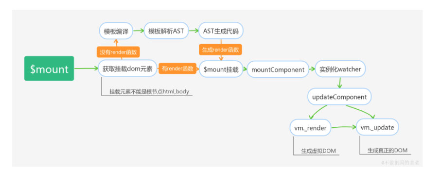

# 实例挂载

有了上面的基础，我们回头看初始化_init的代码，在代码中我们观察到initProxy后有一系列的函数调用，这些函数包括了创建组件关联，初始化事件处理，定义渲染函数，构建数据响应式系统等，最后还有一段代码,在el存在的情况下，实例会调用$mount进行实例挂载。

```
Vue.prototype._init = function (options) {
  ···
  // 选项合并
  vm.$options = mergeOptions(
    resolveConstructorOptions(vm.constructor),
    options || {},
    vm
  );
  // 数据代理
  initProxy(vm);
  vm._self = vm;
  initLifecycle(vm);
  // 初始化事件处理
  initEvents(vm);
  // 定义渲染函数
  initRender(vm);
  // 构建响应式系统
  initState(vm);
  // 等等
  ···
  if (vm.$options.el) {
    vm.$mount(vm.$options.el);
  }
}
```

以手写template模板为例，理清楚什么是挂载。我们会在选项中传递template为属性的模板字符串，如<div>{{message}}</div>，最终这个模板字符串通过中间过程将其转成真实的DOM节点，并挂载到选项中el代表的根节点上完成视图渲染。这个中间过程就是接下来要分析的挂载流程。

Vue挂载的流程是比较复杂的，接下来我将通过流程图，代码分析两种方式为大家展示挂载的真实过程。

## 流程图


如果用一句话概括挂载的过程，可以描述为确认挂载节点,编译模板为render函数，渲染函数转换Virtual DOM,创建真实节点。

## 代码分析
接下来我们从代码的角度去剖析挂载的流程。挂载的代码较多，下面只提取骨架相关的部分代码。

```
// 内部真正实现挂载的方法
Vue.prototype.$mount = function (el, hydrating) {
  el = el && inBrowser ? query(el) : undefined;
  // 调用mountComponent方法挂载
  return mountComponent(this, el, hydrating)
};
// 缓存了原型上的 $mount 方法
var mount = Vue.prototype.$mount;
// 重新定义$mount,为包含编译器和不包含编译器的版本提供不同封装，最终调用的是缓存原型上的$mount方法
Vue.prototype.$mount = function (el, hydrating) {
  // 获取挂载元素
  el = el && query(el);
  // 挂载元素不能为跟节点
  if (el === document.body || el === document.documentElement) {
    warn(
      "Do not mount Vue to <html> or <body> - mount to normal elements instead."
    );
    return this
  }
  var options = this.$options;
  // 需要编译 or 不需要编译
  // render选项不存在，代表是template模板的形式，此时需要进行模板的编译过程
  if (!options.render) {
    ···
    // 使用内部编译器编译模板
  }
  // 无论是template模板还是手写render函数最终调用缓存的$mount方法
  return mount.call(this, el, hydrating)
}
// mountComponent方法思路
function mountComponent(vm, el, hydrating) {
  // 定义updateComponent方法，在watch回调时调用。
  updateComponent = function () {
    // render函数渲染成虚拟DOM， 虚拟DOM渲染成真实的DOM
    vm._update(vm._render(), hydrating);
  };
  // 实例化渲染watcher
  new Watcher(vm, updateComponent, noop, {})
}
```

我们用语言描述挂载流程的基本思路。

* 确定挂载的DOM元素,这个DOM需要保证不能为html，body这类跟节点。
* 我们知道渲染有两种方式，一种是通过template模板字符串，另一种是手写render函数，前面提到template模板需要运行时进行编译，而后一个可以直接用render选项作为渲染函数。因此挂载阶段会有两条分支，template模板会先经过模板的解析，最终编译成render渲染函数参与实例挂载，而手写render函数可以绕过编译阶段，直接调用挂载的$mount方法。
* 针对template而言，它会利用Vue内部的编译器进行模板的编译，字符串模板会转换为抽象的语法树，即AST树，并最终转化为一个类似function(){with(){}}的渲染函数，这是我们后面讨论的重点。
* 无论是template模板还是手写render函数，最终都将进入mountComponent过程,这个阶段会实例化一个渲染watcher,具体watcher的内容，另外放章节讨论。我们先知道一个结论，渲染watcher的回调函数有两个执行时机，一个是在初始化时执行，另一个是当vm实例检测到数据发生变化时会再次执行回调函数。
* 回调函数是执行updateComponent的过程，这个方法有两个阶段，一个是vm._render,另一个是vm._update。 vm._render会执行前面生成的render渲染函数，并生成一个Virtual Dom tree,而vm._update会将这个Virtual Dom tree转化为真实的DOM节点