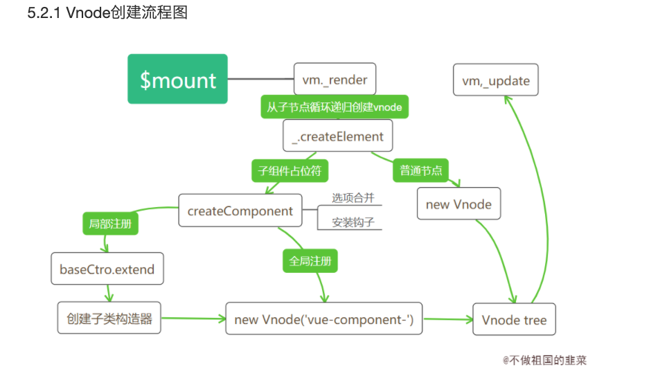

# 组件Vnode创建
上一节内容我们介绍了Vue如何将一个模板，通过render函数的转换，最终生成一个Vnode tree的，在不包含组件的情况下，_render函数的最后一步是直接调用new Vnode去创建一个完整的Vnode tree。然而有一大部分的分支我们并没有分析，那就是遇到组件占位符的场景。执行阶段如果遇到组件，处理过程要比想像中复杂得多，我们通过一张流程图展开分析。



## 具体流程分析
我们结合实际的例子对照着流程图分析一下这个过程：

// 场景
```
Vue.component('test', {
template: '<span></span>'
})
var vm = new Vue({
el: '#app',
template: '<div><test></test></div>'
})
```

// 父render函数
```
function() {
with(this){return _c('div',[_c('test')],1)}
}
```

* Vue根实例初始化会执行 vm.$mount(vm.$options.el)实例挂载的过程，按照之前的逻辑，完整流程会经历render函数生成Vnode,以及Vnode生成真实DOM的过程。
* render函数生成Vnode过程中，子会优先父执行生成Vnode过程,也就是_c('test')函数会先被执行。'test'会先判断是普通的html标签还是组件的占位符。
* 如果为一般标签，会执行new Vnode过程，这也是上一章节我们分析的过程；如果是组件的占位符，则会在判断组件已经被注册过的前提下进入createComponent创建子组件Vnode的过程。
* createComponent是创建组件Vnode的过程，创建过程会再次合并选项配置，并安装组件相关的内部钩子(后面文章会再次提到内部钩子的作用)，最后通过new Vnode()生成以vue-component开头的Virtual DOM
* render函数执行过程也是一个循环递归调用创建Vnode的过程，执行3，4步之后，完整的生成了一个包含各个子组件的Vnode tree

_createElement函数的实现之前章节分析过一部分，我们重点看看组件相关的操作。

```
// 内部执行将render函数转化为Vnode的函数
function _createElement(context,tag,data,children,normalizationType) {
  ···
  if (typeof tag === 'string') {
    // 子节点的标签为普通的html标签，直接创建Vnode
    if (config.isReservedTag(tag)) {
      vnode = new VNode(
        config.parsePlatformTagName(tag), data, children,
        undefined, undefined, context
      );
    // 子节点标签为注册过的组件标签名，则子组件Vnode的创建过程
    } else if ((!data || !data.pre) && isDef(Ctor = resolveAsset(context.$options, 'components', tag))) {
      // 创建子组件Vnode
      vnode = createComponent(Ctor, data, context, children, tag);
    }
  }
}
```

config.isReservedTag(tag)用来判断标签是否为普通的html标签，如果是普通节点会直接创建Vnode节点，如果不是，则需要判断这个占位符组件是否已经注册到，我们可以通过context.$options.components[组件名]拿到注册后的组件选项。如何判断组件是否已经全局注册，看看resolveAsset的实现。

```
// 需要明确组件是否已经被注册
  function resolveAsset (options,type,id,warnMissing) {
    // 标签为字符串
    if (typeof id !== 'string') {
      return
    }
    // 这里是 options.component
    var assets = options[type];
    // 这里的分支分别支持大小写，驼峰的命名规范
    if (hasOwn(assets, id)) { return assets[id] }
    var camelizedId = camelize(id);
    if (hasOwn(assets, camelizedId)) { return assets[camelizedId] }
    var PascalCaseId = capitalize(camelizedId);
    if (hasOwn(assets, PascalCaseId)) { return assets[PascalCaseId] }
    // fallback to prototype chain
    var res = assets[id] || assets[camelizedId] || assets[PascalCaseId];
    if (warnMissing && !res) {
      warn(
        'Failed to resolve ' + type.slice(0, -1) + ': ' + id,
        options
      );
    }
    // 最终返回子类的构造器
    return res
  }
```

拿到注册过的子类构造器后，调用createComponent方法创建子组件Vnode

```
 // 创建子组件过程
  function createComponent (
    Ctor, // 子类构造器
    data,
    context, // vm实例
    children, // 子节点
    tag // 子组件占位符
  ) {
    ···
    // Vue.options里的_base属性存储Vue构造器
    var baseCtor = context.$options._base;
    // 针对局部组件注册场景
    if (isObject(Ctor)) {
      Ctor = baseCtor.extend(Ctor);
    }
    data = data || {};
    // 构造器配置合并
    resolveConstructorOptions(Ctor);
    // 挂载组件钩子
    installComponentHooks(data);
    // return a placeholder vnode
    var name = Ctor.options.name || tag;
    // 创建子组件vnode，名称以 vue-component- 开头
    var vnode = new VNode(("vue-component-" + (Ctor.cid) + (name ? ("-" + name) : '')),data, undefined, undefined, undefined, context,{ Ctor: Ctor, propsData: propsData, listeners: listeners, tag: tag, children: children },asyncFactory);
    return vnode
  }
```

这里将大部分的代码都拿掉了，只留下创建Vnode相关的代码，最终会通过new Vue实例化一个名称以vue-component-开头的Vnode节点。其中两个关键的步骤是配置合并和安装组件钩子函数，选项合并的内容可以查看这个系列的前两节，这里看看installComponentHooks安装组件钩子函数时做了哪些操作。

```
  // 组件内部自带钩子
 var componentVNodeHooks = {
    init: function init (vnode, hydrating) {
    },
    prepatch: function prepatch (oldVnode, vnode) {
    },
    insert: function insert (vnode) {
    },
    destroy: function destroy (vnode) {
    }
  };
var hooksToMerge = Object.keys(componentVNodeHooks);
// 将componentVNodeHooks 钩子函数合并到组件data.hook中 
function installComponentHooks (data) {
    var hooks = data.hook || (data.hook = {});
    for (var i = 0; i < hooksToMerge.length; i++) {
      var key = hooksToMerge[i];
      var existing = hooks[key];
      var toMerge = componentVNodeHooks[key];
      // 如果钩子函数存在，则执行mergeHook$1方法合并
      if (existing !== toMerge && !(existing && existing._merged)) {
        hooks[key] = existing ? mergeHook$1(toMerge, existing) : toMerge;
      }
    }
  }
function mergeHook$1 (f1, f2) {
  // 返回一个依次执行f1,f2的函数
    var merged = function (a, b) {
      f1(a, b);
      f2(a, b);
    };
    merged._merged = true;
    return merged
  }
```

## 局部注册和全局注册的区别
在说到全局注册和局部注册的用法时留下了一个问题，局部注册和全局注册两者的区别在哪里。其实局部注册的原理同样简单，我们使用局部注册组件时会通过在父组件选项配置中的components添加子组件的对象配置，这和全局注册后在Vue的options.component添加子组件构造器的结果很相似。区别在于：

* 1.局部注册添加的对象配置是在某个组件下，而全局注册添加的子组件是在根实例下。

* 2.局部注册添加的是一个子组件的配置对象，而全局注册添加的是一个子类构造器。

因此局部注册中缺少了一步构建子类构造器的过程，这个过程放在哪里进行呢？ 回到createComponent的源码,源码中根据选项是对象还是函数来区分局部和全局注册组件，如果选项的值是对象，则该组件是局部注册的组件，此时在创建子Vnode时会调用 父类的extend方法去创建一个子类构造器。

```
function createComponent (...) {
  ...
  var baseCtor = context.$options._base;
  // 针对局部组件注册场景
  if (isObject(Ctor)) {
      Ctor = baseCtor.extend(Ctor);
  }
}
```