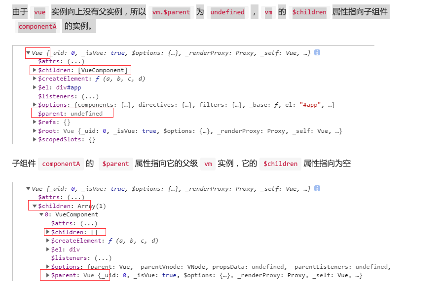

# 建立组件联系
日常开发中，我们可以通过vm.$parent拿到父实例，也可以在父实例中通过vm.$children拿到实例中的子组件。显然，Vue在组件和组件之间建立了一层关联。接下来的内容，我们将探索如何建立组件之间的联系。

不管是父实例还是子实例，在初始化实例阶段有一个initLifecycle的过程。这个过程会把当前实例添加到父实例的$children属性中，并设置自身的$parent属性指向父实例。举一个具体的应用场景：

```
<div id="app">
    <component-a></component-a>
</div>
Vue.component('component-a', {
    template: '<div>a</div>'
})
var vm = new Vue({ el: '#app'})
console.log(vm) // 将实例对象输出
```



## 源码分析如下：

```
function initLifecycle (vm) {
    var options = vm.$options;
    // 子组件注册时，会把父组件的实例挂载到自身选项的parent上
    var parent = options.parent;
    // 如果是子组件，并且该组件不是抽象组件时，将该组件的实例添加到父组件的$parent属性上，如果父组件是抽象组件，则一直往上层寻找，直到该父级组件不是抽象组件，并将，将该组件的实例添加到父组件的$parent属性
    if (parent && !options.abstract) {
        while (parent.$options.abstract && parent.$parent) {
        parent = parent.$parent;
        }
        parent.$children.push(vm);
    }
    // 将自身的$parent属性指向父实例。
    vm.$parent = parent;
    vm.$root = parent ? parent.$root : vm;
    vm.$children = [];
    vm.$refs = {};
    vm._watcher = null;
    vm._inactive = null;
    vm._directInactive = false;
    // 该实例是否挂载
    vm._isMounted = false;
    // 该实例是否被销毁
    vm._isDestroyed = false;
    // 该实例是否正在被销毁
    vm._isBeingDestroyed = false;
}
```

最后简单讲讲抽象组件，在vue中有很多内置的抽象组件，例如<keep-alive></keep-alive>,<slot><slot>等，这些抽象组件并不会出现在子父级的路径上，并且它们也不会参与DOM的渲染。


