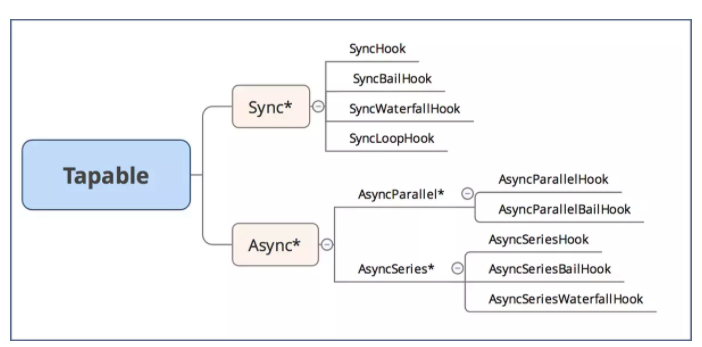

# Tapable

Webpack 是一个现代 JavaScript 应用程序的静态模块打包器，是对前端项目实现自动化和优化必不可少的工具，Webpack 的 loader（加载器）和 plugin（插件）是由 Webpack 开发者和社区开发者共同贡献的，而目前又没有比较系统的开发文档，想写加载器和插件必须要懂 Webpack 的原理，即看懂 Webpack 的源码，tapable 则是 Webpack 依赖的核心库，可以说不懂 tapable 就看不懂 Webpack 源码，所以本篇会对 tapable 提供的类进行解析和模拟。

## 介绍
Webpack 本质上是一种事件流的机制，它的工作流程就是将各个插件串联起来，而实现这一切的核心就是 tapable，Webpack 中最核心的，负责编译的 Compiler 和负责创建 bundles 的 Compilation 都是 tapable 构造函数的实例。

